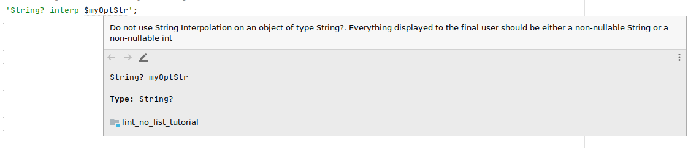
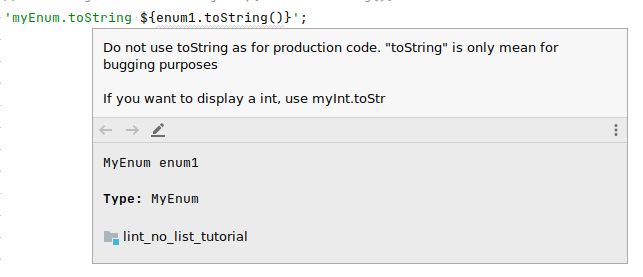
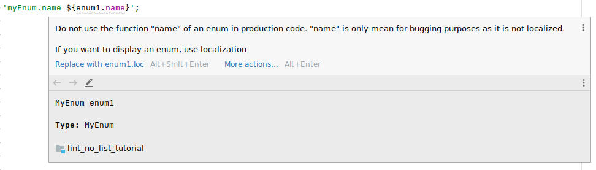
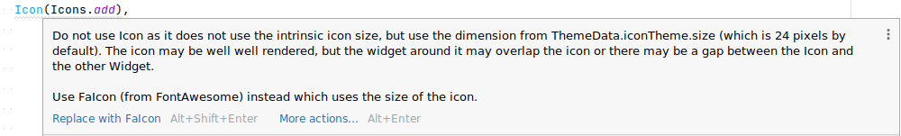

# FlutterLinter

Implementation of Flutter lints which warns the user about common mistake.
Some lints have associated quick fix.

This lint uses the [custom_lint] package.

## Index
- [How to install](#How to install)
- [Lints](#Lints)

## How to install
1. Add this package as dev_dependency in your `pubspec.yaml`:
```yaml
dev_dependencies:
  flutter_linter:
    git:
      url: https://github.com/pixelshot91/flutter_linter.git
```
2. Add this linter in your `analysis_options.yaml`:
```yaml
analyzer:
  plugins:
    - custom_lint
```

For more information, you can look at the [official custom_lint readme](https://github.com/invertase/dart_custom_lint#using-our-custom-lint-package-in-an-application)


## Lints

### do_not_use_unsafe_string_interpolation


### do_not_use_toString


### do_not_use_enum_name


### do_not_use_flutter_icon

